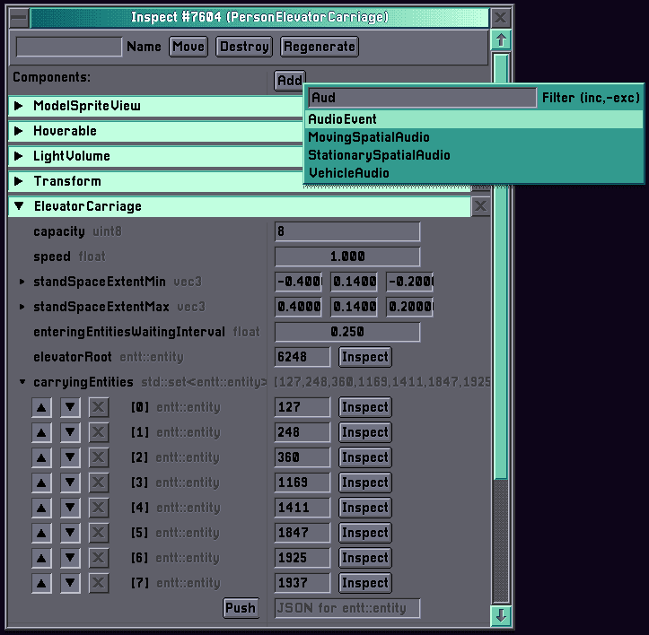
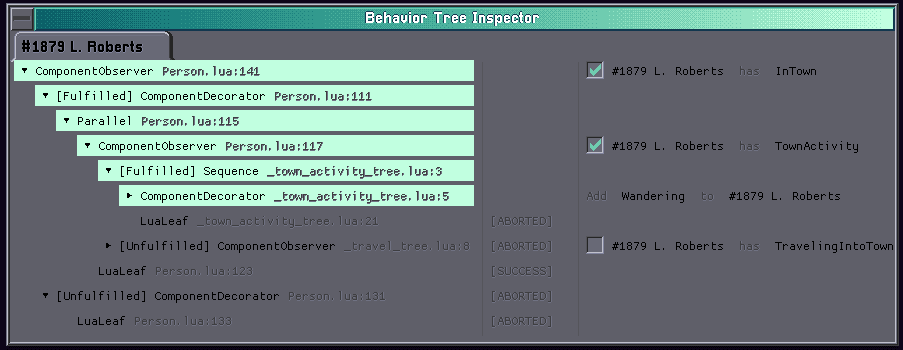

# Dibidab Engine 2

Dibidab is a small ECS-based game engine that I use in my game projects.

## Dependencies

- [GU](https://github.com/hilkojj/gu): My C++ OpenGL game library for Desktop & Web.
- [Dibidab Header Tool](https://github.com/hilkojj/dibidab-header): My tool that generates reflection code, Lua bindings and JSON-(de)serialization code.
- [EnTT](https://github.com/skypjack/entt): Core functionality for using the Entity-Component-System pattern.
- [Lua](https://github.com/lua/lua) and [Sol2](https://github.com/ThePhD/sol2): For scripting and Lua bindings.

Dependencies are included using submodules in `external/.`
Run `git submodule update --init --recursive` before configuring CMake.

## Features
This engine is built as a library and exposes the APIs of the other libraries listed above.
Next to the features that those libraries offer, Dibidab has features including:

### Entity Templates & Scripting
Entity templates can be made in Lua scripts.
Because each Component automatically has Lua bindings generated for them, they can be added/modified/removed by the Lua script.
Not only is this possible during the creation of the entity, but also in callbacks of Event listeners or timeouts/intervals. 

```lua
-- Save template, args and transform:
persistenceMode(TEMPLATE | ARGS, {
    "Transform"
})

-- Arguments that can be changed in UI, or from other scripts:
defaultArgs({
    modelName = "TestCar",
    maxVelocity = 3.0,
    maxForce = 2000.0
})

function create(vehicle, args)

    setComponents(vehicle, {
        Vehicle {
            maxVelocity = args.maxVelocity,
            maxForce = args.maxForce
        },
        ModelSpriteView {
            modelName = args.modelName
        },
        PathFinding {
            navData = navData.VEHICLE
        },
        Hoverable {
            category = hoverableMasks.VEHICLE | hoverableMasks.INTERACTABLE
        },
        MovingSpatialAudio()
    })

    setTimeout(vehicle, 0.5, function()
        print("hello!")
    end)
end


```

### Entity Inspection
Because Components automatically have reflection and serialization code generated for them,
Components can be inspected and modified using an in-game GUI.
The Inspector/Reflection code is smart enough to allow you to inspect maps, vectors, etc..


### Behavior Trees
The engine comes with a Behavior Tree implementation that can be used for controlling entities with AI.
Behavior trees and custom Tree Nodes can be made in Lua and/or C++.
Branches of the trees can be entered based on the presence or absence of Components on the entity,
and Nodes can add/remove/modify Components any way they like.

The implementation allows for running hundreds/thousands of entities with a behavior tree.

A running behavior tree can be inspected using an in-game GUI.


### Level saving/loading
Levels can be saved and loaded. A level can consist out of multiple rooms.
Each room is a 'ECS-Engine' with a set of Systems and Entities, of which any can be persistent.
